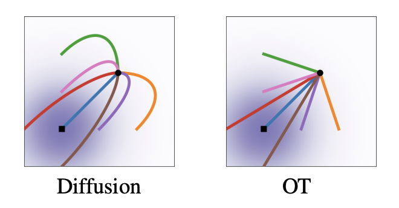
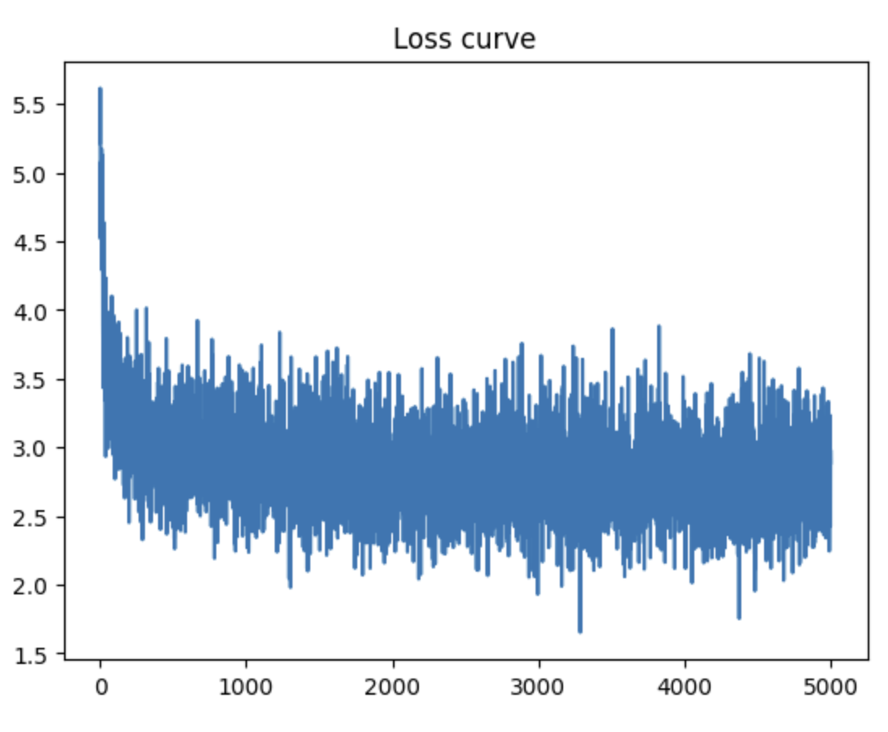
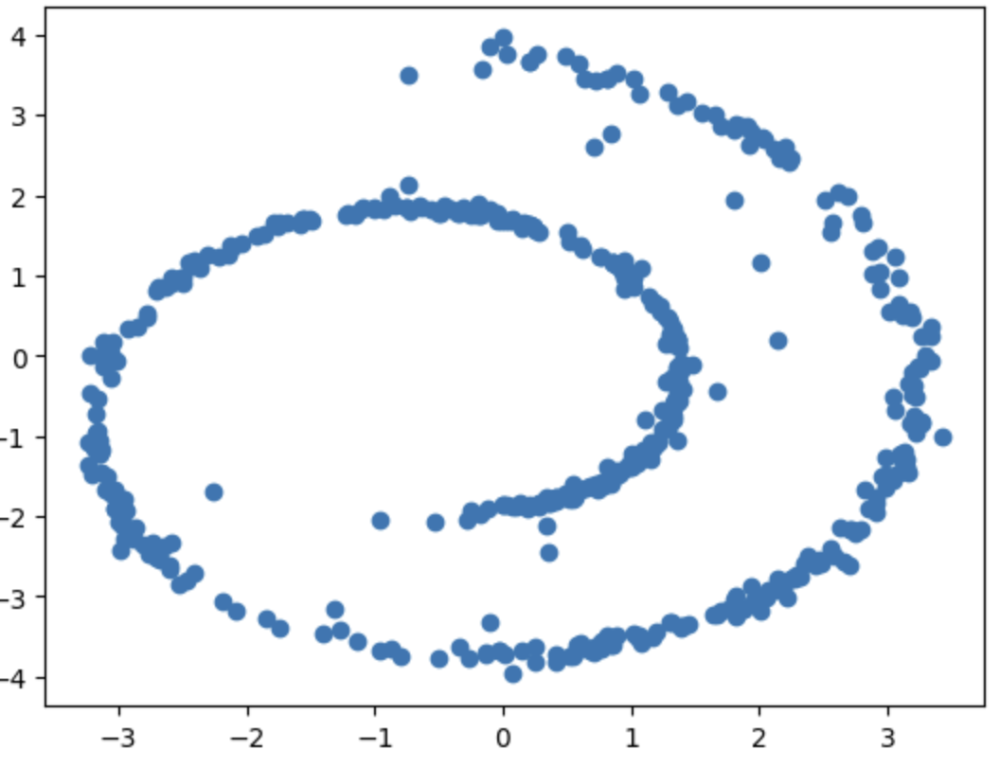

<div align=center>
  <h1>
  Flow Matching
  </h1>
  <p>
    <a href=https://mhsung.github.io/kaist-cs492d-fall-2024/ target="_blank"><b>KAIST CS492(D): Diffusion Models and Their Applications (Fall 2024)</b></a><br>
    Programming Assignment 7
  </p>
</div> 

<div align=center>
  <p>
    Instructor: <a href=https://mhsung.github.io target="_blank"><b>Minhyuk Sung</b></a> (mhsung [at] kaist.ac.kr)<br>
    TA: <a href=https://63days.github.io target="_blank"><b>Juil Koo</b></a>  (63days [at] kaist.ac.kr)<br>
  </p>
</div>

<div align=center>
   
</div>


## Abstract
Flow Matching (FM) is a novel generative framework that shares similarities with diffusion models, particularly in how both tackle the Optimal Transport problem through an iterative process. Similar to diffusion models, FM also splits the sampling process into several time-dependent steps. At first glance, FM and diffusion models may seem almost identical due to their shared iterative sampling approach. However, the key differences lie in the objectve function and the choice of trajectories in FM. 

Regading the objective function, diffusion models predict the injected noise during training. In contrast, Flow Matching predicts the displacement between the data distribution and the prior distribution. 

Moreover, Flow Matching is developed from the perspective of _flow_, a time-dependent transformation function that corresponds to the forward pass in diffusion models. Unlike diffuison models, where the forward pass is fixed to ensure that every intermediate distribution also follows a Gaussian distribution, FM offers much greater flexibility in the choice of _flow_. This flexibility allows for the use of simpler trajectories, such as linear interpolation over time, between the data distribution and the prior distribution.

Experimental results have sohwn that the FM objective and its simpler trajectory are highly effective in modeling the data distribution, Making FM a compelling alternative to diffusion models.

## Setup

Install the required package within the `requirements.txt`
```
pip install -r requirements.txt
```

**Please note that this assignment is heavily dependent on Assignment 2. To begin, you should copy the functions you implemented in [Assignment 2](https://github.com/KAIST-Visual-AI-Group/Diffusion-Assignment2-DDIM-CFG).** 

## Code Structure
```
.
├── 2d_plot_fm_todo    (Task 1)
│   ├── fm_tutorial.ipynb         <--- Main code
│   ├── dataset.py                <--- Define dataset (Swiss-roll, moon, gaussians, etc.)
│   ├── network.py                <--- A vector field prediction network
│   └── fm.py                     <--- (TODO) Implement Flow Matching
│
└── image_fm_todo (Task 2)
    ├── dataset.py                <--- Ready-to-use AFHQ dataset code
    ├── fm.py                     <--- (TODO) Implement Flow Matching
    ├── module.py                 <--- Basic modules of a vector field prediction network
    ├── network.py                <--- U-Net
    ├── sampling.py               <--- Image sampling code
    └── train.py                  <--- Flow Matching training code
```


## Task 0: Introduction
### Assignment Tips

In this assignment, we explore Flow Matching (FM), a method that, like diffusion models, deals with time-dependent trajectories but does so from the perspective of vector fields that construct probability density paths. At a high level, FM shares similarities with diffusion models but offers more straight trajectories. Unlike the diffusion models, whose trajectories involve nonlinear terms that add unnecessary complexity, the trajectories in FM can be much simpler. They can be represented as a simple linear interpolation between the data point $x_0$ and random noise $x_1$​ over time $t$. As before, we recommend thoroughly understanding the equations presented in the papers before starting the assignment. The following is a list of recommended resources:

1. [[Paper](https://arxiv.org/abs/2210.02747)] Flow Matching for Generative Modeling (FM)
2. [[Paper](https://arxiv.org/abs/2209.03003)] Flow Straight and Fast: Learning to Generate and Transfer Data with Rectified Flow (RF)
3. [[Blog](https://mlg.eng.cam.ac.uk/blog/2024/01/20/flow-matching.html)] An Introduction to Flow Matching

Further material is listed at the bottom of the document.

### Modeling the data distribution with flow
In FM, we have a probability density path $p: [0,1] \times \mathbb{R}^d \rightarrow \mathbb{R}\_{>0}$, which is a time dependent probabilty density function, i.e., $\int p\_t(x) dx = 1$. Starting from the simple tractable distribution $p\_0(x) = p\_{\text{prior}}$, we aim to transform it into a more complex distribution $p\_1(x) = p\_{\text{data}}$ using a time-dependent diffeomorphic map, called _flow_: $\psi: [0,1] \times \mathbb{R}^d \rightarrow \mathbb{R}^d$. Rather than directly modeling the flow itself, as we've done in diffusion models, we instead model the derivative of the flow with respect to $t$, which is called _vector field_ $\frac{d}{dt}\psi\_t(x) = v\_t(\psi\_t(x))$.
Given a target probability density path $p\_t(x)$ and a corresponding vector field $u\_t(x)$, we define the Flow Matching objective as:

$$
\begin{align*}
\mathcal{L}\_{\text{FM}} (\theta) = \mathbb{E}\_{t, p\_t(x)} \Vert v\_t(x;\theta) - u\_t(x) \Vert^2 
\end{align*}.
$$

However, since $p\_t$ and $u\_t$ are intractable, we make the training simpler by modeling the conditional probability paths and vector fields:

$$
\begin{align*}
p\_t(x) &= \int p\_t(x | x_1) q(x_1) dx_1 \\
u\_t(x) &= \int u\_t(x | x_1) \frac{p\_t(x | x\_1) q(x\_1)} {p_t(x)} dx_1
\end{align*}
$$

The equations above can be derived from the _continuity equation_: $\partial p_t(x) / \partial t = -\nabla \cdot (p_t(x) v_t(x)).$
See the appendix A of the FM paper for more details.

Given the conditional probabiliy paths $p_t(x|x_1)$ and vector fields $u_t(x | x_1)$, we define conditional flow matching objective as:

$$
\begin{align*}
\mathcal{L}\_{\text{CFM}} (\theta) = \mathbb{E}\_{t, p\_1(x\_1), p\_t(x | x\_1)} \Vert v\_t(x;\theta) - u\_t(x | x_1) \Vert^2 
\end{align*}
$$

### Special instances of Flow Matching
While the conditional probability paths and vector fields can be designed in various ways, we opt for the simplest vector field, which takes the form of a Gaussian kernel:

$$
\begin{align*}
p\_t(x | x_1) &= \mathcal{N}(x | \mu_t(x_1), \sigma_t(x_1)^2 I) \\
\psi_t(x) &= \sigma_t(x_1)x + \mu_t(x_1)
\end{align*}.
$$

Specifically, we set $\mu_t(x) = tx_1$, and $\sigma_t(x) = 1 - (1 - \sigma\_{\text{min}})t$. Given the $\mu_t(x)$ and $\sigma_t(x)$, the conditional flow is defined as follows: $\psi_t(x) = (1 - (1 - \sigma\_{\text{min}} )t)x + tx_1$.

In this case, the CFM loss takes the following form:

$$
\begin{align*}
\mathcal{L}\_{\text{CFM}} (\theta) = \mathbb{E}\_{t, p\_1(x\_1), p\_t(x | x\_1)} \Vert v\_t(\psi_t(x\_0);\theta) - (x_1 - (1 - \sigma\_{\text{min}}) x_0) \Vert^2 
\end{align*}
$$

## Task 1: FM with Swiss-Roll
As similar to previous Assignments 1 and 2, we will first implement Flow Matching (FM) and test it in a simple 2D plot toy experiment setup. 

❗️❗️❗️ **You are only allowed to edit the part marked by TODO.** ❗️❗️❗️

### TODO
In this assignment, you will implement all key functions of flow matching for training and sampling.

#### 1-0: Copy the previous completed implementations
You can copy the `2d_plot_ddpm_todo/network.py` and `image_ddpm_todo/network.py` that you've already implemented in Assignments 1 and 2.

#### 1-1: Implement Flow Matching Scheduler
complete the functions `compute_psi_t()` and `step()` of `FMScheduler` class in `fm.py`.
The `step()` function is a one step of ODESolver from $t=0$ to $t=1$. Although more sophisticated numerical method can be used, you just need to implement the simplest one, first-order Euler method. 

$$
\begin{align*}
x_{t+\Delta t} = x_t + \Delta t \frac{\partial x_t}{\partial t},
\end{align*}
$$

where $\frac{\partial x_t}{\partial t}$ would be modeled by a neural network.


#### 1-2: Implement the conditional flow matching objective.
Complete `get_loss()` function of `FlowMatching` in `fm.py` that corresponds to the conditional flow matching objective written in Eq. 23 of the FM paper.


#### 1-3: Implement the sampling code.
Complete `sample()` function of `FlowMatching` in `fm.py`.

#### 1-4: Training and Evaluation
Once you finish the implementation above, open and run `fm_tutorial.ipynb` via jupyter notebook. It will automatically train a FM and measure chamfer distance between 2D particles sampled by the FM and 2D particles sampled from the target distribution. 

Take screenshots of:

1. the training loss curve
2. the Chamfer Distance reported after executing the Jupyter Notebook
3. the visualization of the sampled particles.

Below are the xamples of (1) and (3).

<p align="center">
  
</p>

<p align="center">
  
</p>


Note that you need to run sampling with 50 inference steps, which is set as the default.

## Task 2: Image Generation with FM

### TODO
If you've completed Task 1, finish implementing the `sample()` function and `get_loss()` function to work with a classifier-free guidance setup.
After finishing the implementation for the CFG setup, train FM with the CFG setup: `python train.py --use_cfg`.

❗️❗️❗️ **You are only allowed to edit the part marked by TODO.** ❗️❗️❗️

It will sample images and save a checkpoint every `args.log_interval`. After training a model, sample and save images by

```
python sampling.py --use_cfg --ckpt_path ${CKPT_PATH} --save_dir ${SAVE_DIR_PATH}
```

We recommend starting the training as soon as possible as the training would take 14 hours.

As done in Assignments 1 and 2, measure FID score using the pre-trained classifier network provided previously.

```
python dataset.py
python fid/measure_fid.py $GT_IMG_DIR $GEN_IMG_DIR
```
Use the evaluation set of the AFHQ dataset, `data/afhq/eval`, not `data/afhq/val` as @GT_IMG_DIR. 

Take a screenshot of a FID and include at least 8 sampled images.


## What to Submit

<details>
<summary><b>Submission Item List</b></summary>
</br>

- [ ] Code without model checkpoints
      
**Task 1**
- [ ] Loss curve screenshot
- [ ] Chamfer distance results of FM sampling with 50 inference steps.
- [ ] Visualization of FM sampling.

      
**Task 2**
- [ ] FID score result obtained with the CFG scale of 7.5
- [ ] At least 8 images generated by Flow Matching
</details>

In a single PDF file, write your name and student ID, and include submission items listed above. Refer to more detailed instructions written in each task section about what to submit.
Name the document `{NAME}_{STUDENT_ID}.pdf` and submit **both your code and the document** as a **ZIP** file named `{NAME}_{STUDENT_ID}.zip`. 
**For this programming assignment**, exclude any model checkpoints and the provided pre-trained classifier checkpoint when compressing the files.
Submit the zip file on GradeScope.

## Grading
**You will receive a zero score if:**
- **you do not submit,**
- **your code is not executable in the Python environment we provided, or**
- **you modify anycode outside of the section marked with `TODO` or use different hyperparameters that are supposed to be fixed as given.**

**Plagiarism in any form will also result in a zero score and will be reported to the university.**

**Your score will incur a 10% deduction for each missing item in the submission item list.**

Otherwise, you will receive up to 20 points from this assignment that count toward your final grade.

- Task 1
  - 10 points: Achieve CD lower than 40.
  - 5 points: Achieve greater, or equal to 40 and less than 60.
  - 0 point: otherwise.
- Task 2
  - 10 points: Achieve FID lower than **30** with CFG=7.5.
  - 5 points: Achieve FID between **30** and **50** with CFG=7.5.
  - 0 point: otherwise.

## Further Readings

If you are interested in this topic, we encourage you to check ou the materials below.

- [Flow Matching for Generative Modeling](https://arxiv.org/abs/2210.02747)
- [Flow Straight and Fast: Learning to Generate and Transfer Data with Rectified Flow](https://arxiv.org/abs/2209.03003)
- [An Introduction to Flow Matching](https://mlg.eng.cam.ac.uk/blog/2024/01/20/flow-matching.html)
- [Neural Ordinary Differential Equations](https://arxiv.org/abs/1806.07366)
